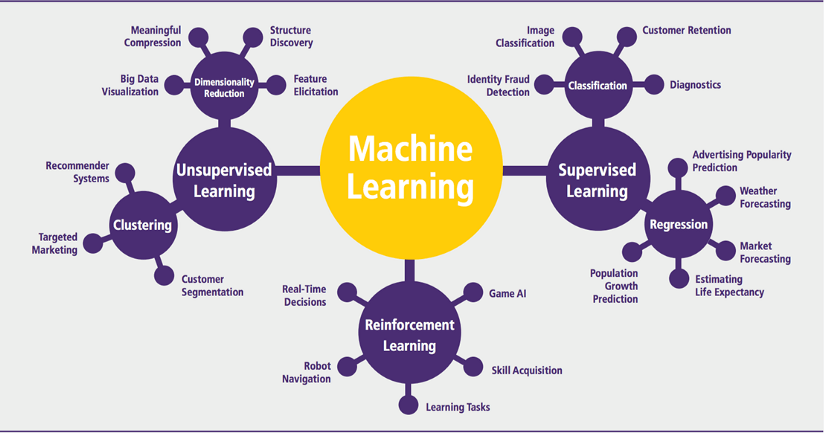

## Common characteristics of ML algorithms:

- Machine learning algorithms can be described using math and pseudocode.

- The efficiency of machine learning algorithms can be analyzed and described, so it can be further improved.

## Main categories of ML algorithms:

Machine Learning algorithms are commonly divided into categories according to their purpose.

- Supervised learning: 
    **This method is useful when you have existing data for the output you are trying to predict.**
    - Main Goal: Predictive Model.
    - Objectives include: 
        > Classification of data: like images or voices.
        > Regression: like risk estimation or score prediction.
    - Input: Labeled data.
    - Output: A model representing the relationships between the output and input features.
    - Examples of algorithms: Linear Regression, Neural Networks, Decision Trees...

- Unsupervised Learning:
    **This method is particularly useful in cases where the human expert doesn’t know what to look for in the data. Because there's no teacher, the machine might teach you new things while finding patterns.**
    - Main Goal: Descriptive Model.
    - Objectives include: 
        > Clustering of data: grouping similar patterns (also called cluster): in biology, market...
        > Association: finds interesting relations between different variables in big datasets.
        > Dimensionality reduction: simplifying data by taking only the most important parts: face or image recognition, text mining...
    - Input: Unlabeled data.
    - Output: Mines for rules, detects patterns, summize and group data points which may help deriving meaningful insights and describe the data better to the users.
    - Examples of algorithms: K-Means Clustering, Hidden Markov, Neural Networks...

- Semi-supervised Learning: 
    **Essencially a mix of supervised and unsupervised learning. It's most suitable for model building, in the absense of labels in the majority of data and presense of only a few. These methods exploit the idea that even though the group memberships of the unlabeled data are unknown, this data carries important information about the group parameters.**
    - Main Goal: Both Predictive and Descriptive Model.

- Reinforcement Learning: 
    **Famously used in chess. The reinforcement learning algorithm (called the agent) continuously interact and learn from the environment in an iterative fashion, aiming at maximizing the reward and minimizing the risk by determining the most ideal behaviour in a certain context.** 
    *When this step is repeated, the problem is known as a Markov Decision Process.*
    *For the agent to learn from its behaviour, a simple reward feedback is required also known as the reinforcement signal.*
    - Main Goal: Most Optimal Model.
    - Input: Random. Observed directly.
    - Output: Every action is associated with an estimable reward based on how it went.
    - Examples of algorithms: Q-Learning, Temporal Difference (TD), Deep Adversarial Networks...

